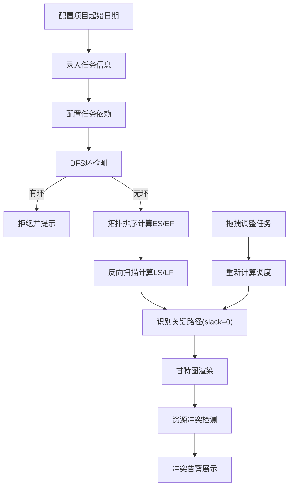

## 1. 产品概述
项目管理工具，支持任务列表管理、依赖关系配置、关键路径自动计算及甘特图可视化展示。帮助项目管理者清晰识别关键任务链，优化资源分配，确保项目按时交付。

## 2. 核心功能

### 2.1 功能模块
1. **任务管理模块**：任务的增删改查，支持配置任务名称、工期、负责人、依赖关系
2. **依赖关系模块**：任务间依赖配置，实时环检测，禁止循环依赖
3. **调度计算模块**：基于拓扑排序计算最早/最晚开始结束时间（ES/EF/LS/LF）
4. **关键路径模块**：自动识别关键路径（总时差为0的链路），支持多条关键路径
5. **甘特图模块**：横向时间轴甘特图，支持日/周/月视图缩放，任务拖动调整
6. **资源分配模块**：检测同一负责人在同一时段的任务冲突并报警

### 2.2 页面详情
| 页面名称 | 模块名称 | 功能描述 |
|----------|----------|----------|
| 主页面 | 任务表格 | 展示所有任务列表，支持内联编辑，高亮显示关键任务 |
| 主页面 | 甘特图区域 | SVG 自绘甘特图，任务条颜色区分关键/普通路径，支持缩放和拖拽 |
| 主页面 | 配置面板 | 项目起始日期配置，视图切换（日/周/月），冲突告警展示 |
| 主页面 | 任务编辑弹窗 | 新增/编辑任务详情，依赖关系选择器 |

## 3. 核心流程
用户创建项目并配置起始日期 → 录入任务信息（名称、工期、负责人）→ 配置任务间依赖关系（自动环检测）→ 系统自动调度计算 ES/EF/LS/LF → 识别关键路径 → 甘特图可视化展示 → 检测资源冲突并报警 → 用户可拖动任务条手动调整开始时间

## 4. 用户界面设计

### 4.1 设计风格
- 主色调：深蓝色 `#1e3a5f`，关键路径高亮色 `#dc2626`，普通任务 `#2563eb`
- 辅助色：告警色 `#f59e0b`，成功色 `#10b981`
- 字体：标题使用 Playfair Display，正文使用 JetBrains Mono
- 布局：左侧任务表格 + 右侧甘特图的双栏布局，顶部工具栏
- 风格：专业工业风，清晰的网格线，对比强烈的色彩区分

### 4.2 页面设计概述
| 页面名称 | 模块名称 | UI 元素 |
|----------|----------|---------|
| 主页面 | 顶部工具栏 | 项目日期选择器、视图切换按钮、新增任务按钮、冲突告警徽章 |
| 主页面 | 任务表格 | 可编辑行、关键路径红色标记、依赖标签、浮动操作按钮 |
| 主页面 | 甘特图 | 时间轴刻度、任务条（可拖拽）、依赖连线、今日线、网格背景 |
| 主页面 | 任务编辑弹窗 | 表单输入、依赖多选器、保存/取消按钮 |

### 4.3 响应式
桌面端优先设计，双栏布局；窄屏时切换为上下布局，表格在上甘特图在下，支持横向滚动查看甘特图。
