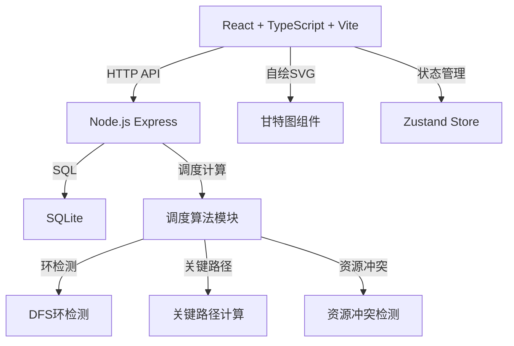
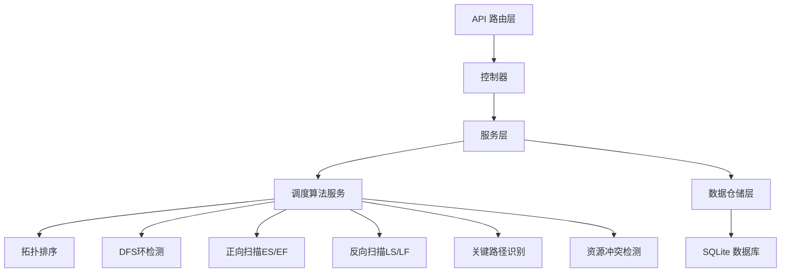
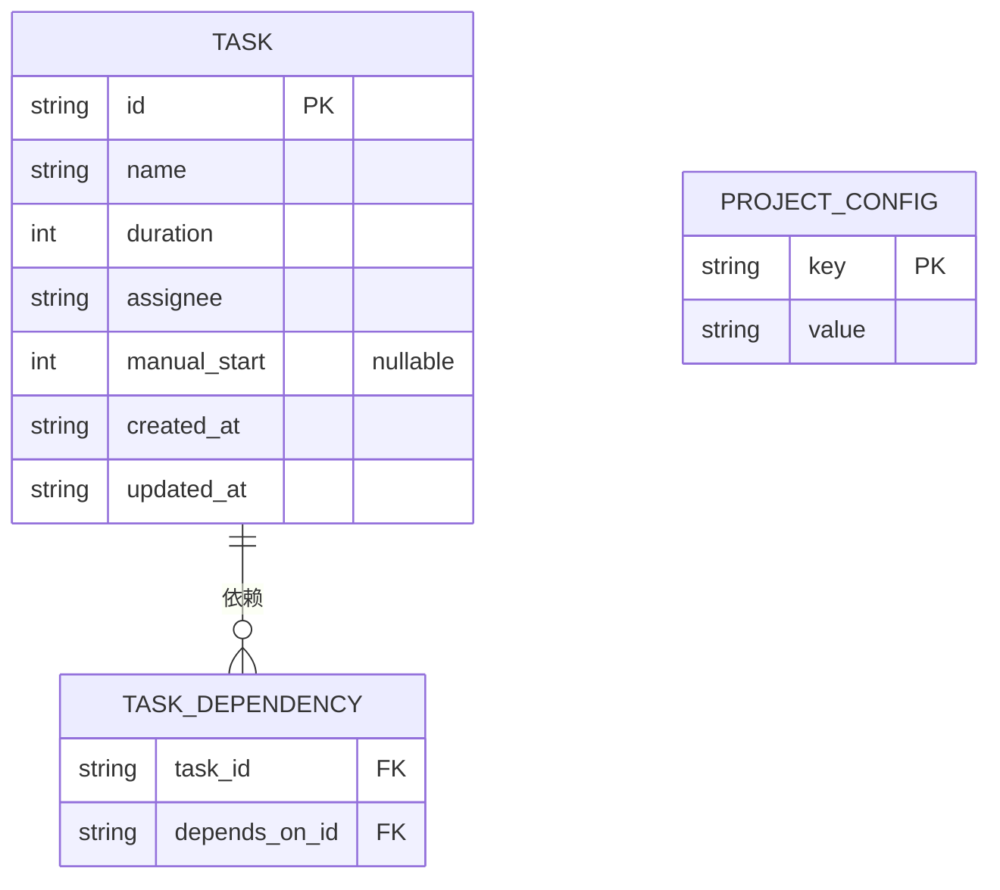

## 1. 架构设计



## 2. 技术描述
- **前端**：React 18 + TypeScript + Vite + Tailwind CSS 3 + Zustand
- **后端**：Express 4 + TypeScript + better-sqlite3
- **数据库**：SQLite，本地文件存储
- **甘特图**：纯 SVG 自绘，不依赖第三方图表库

## 3. 路由定义
| 路由 | 方法 | 用途 |
|------|------|------|
| /api/tasks | GET | 获取所有任务列表（含调度计算结果） |
| /api/tasks | POST | 新增任务 |
| /api/tasks/:id | PUT | 更新任务 |
| /api/tasks/:id | DELETE | 删除任务 |
| /api/config | GET | 获取项目配置（起始日期等） |
| /api/config | PUT | 更新项目配置 |
| /api/schedule | POST | 触发重新调度计算 |

## 4. API 定义

```typescript
// 任务数据模型
interface Task {
  id: string;
  name: string;
  duration: number; // 工作日
  assignee: string;
  dependsOn: string[]; // 前置任务ID列表
  // 调度计算结果
  es: number; // 最早开始（第N个工作日）
  ef: number; // 最早结束
  ls: number; // 最晚开始
  lf: number; // 最晚结束
  slack: number; // 总时差
  isCritical: boolean;
  startDate: string; // ISO日期
  endDate: string;
  // 手动模式
  manualStart?: number; // 用户手动设置的开始日
}

interface ProjectConfig {
  startDate: string; // ISO日期，项目起始日
}

interface ScheduleResult {
  tasks: Task[];
  criticalPaths: string[][]; // 多条关键路径
  conflicts: ResourceConflict[];
}

interface ResourceConflict {
  assignee: string;
  tasks: string[];
  startDay: number;
  endDay: number;
}
```

## 5. 服务器架构图



## 6. 数据模型

### 6.1 ER 图



### 6.2 DDL

```sql
CREATE TABLE tasks (
  id TEXT PRIMARY KEY,
  name TEXT NOT NULL,
  duration INTEGER NOT NULL CHECK (duration > 0),
  assignee TEXT NOT NULL,
  manual_start INTEGER,
  created_at TEXT DEFAULT CURRENT_TIMESTAMP,
  updated_at TEXT DEFAULT CURRENT_TIMESTAMP
);

CREATE TABLE task_dependencies (
  task_id TEXT NOT NULL,
  depends_on_id TEXT NOT NULL,
  PRIMARY KEY (task_id, depends_on_id),
  FOREIGN KEY (task_id) REFERENCES tasks(id) ON DELETE CASCADE,
  FOREIGN KEY (depends_on_id) REFERENCES tasks(id) ON DELETE CASCADE
);

CREATE TABLE project_config (
  key TEXT PRIMARY KEY,
  value TEXT NOT NULL
);

-- 初始配置
INSERT INTO project_config (key, value) VALUES 
('start_date', date('now'));

-- 初始测试数据
INSERT INTO tasks (id, name, duration, assignee) VALUES 
('A', '需求分析', 3, '张三'),
('B', '系统设计', 2, '李四'),
('C', '开发实现', 5, '王五'),
('D', 'UI设计', 2, '赵六'),
('E', '测试验收', 3, '张三');

INSERT INTO task_dependencies (task_id, depends_on_id) VALUES 
('B', 'A'),
('D', 'A'),
('C', 'B'),
('C', 'D'),
('E', 'C');
```
